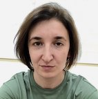

# Mariia Moniakova

## My contacts:
----

* **Phone:** +79502263735
* **Email:** improverall-mm@gmail.com
* **GitHub:** [@kotovi4](https://github.com/kotovi4)
* **Discord:** Mariia M.(@kotovi4)

## About me:
----
I have been interested in the topic of creating websites and applications for a long time. As part of my work, I had to deal with the administration of the company's websites and I decided to delve deeper into the study of front-end development. I have completed the Frontend Developer course from HTML-Academy, completed several training projects and am currently working on a commercial project. My dream is to get into EPAM.

## My skills:
----
- HTML (BEM methodology, cross-browser and responsive layout)
- CSS (Less/SASS, PostCSS, Preprocessor)
- JavaScript
- Git
- Gulp
- Webpack
- Figma
- Adobe Photoshop
- Adobe Illustrator
- изучаю юнит-тесты на Jest и Vue Test Utils